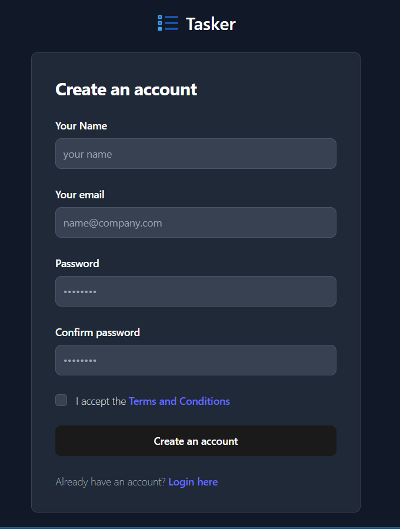

# Task Management Application

This project is a simple task management application designed to showcase full-stack development skills. The application allows users to create, edit, and delete tasks, prioritize tasks, set due dates, mark tasks as completed, and provides filtering and search functionality for tasks.

Link to Live demo : https://task-management-app-two-psi.vercel.app

Github repo : https://github.com/shubham691438/task-management-app

## Features

### Frontend
- User-friendly and intuitive interface developed React and Tailwind
- User registration and login functionality 
- Task prioritization (e.g., high, medium, low).
- Setting due dates for tasks.
- Marking tasks as completed.
- Filtering and search functionality for tasks.

### Backend
- Build using nodejs , express and Mongodb
- CRUD operations for tasks (Create, Read, Update, Delete)
- Secure user authentication and authorization.
- RESTful API endpoints for CRUD operations on tasks.